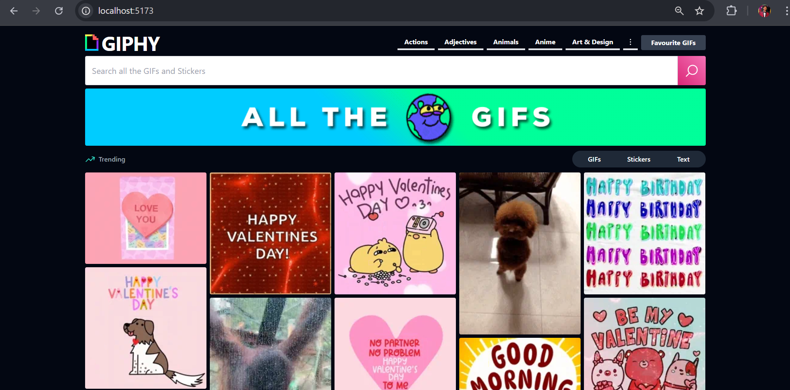

# GIPHY Clone

A full-featured GIPHY clone built with React that allows users to search, browse, and interact with GIFs using the GIPHY API.



## Features

- 🔍 Search GIFs, Stickers, and Text
- 🔥 Browse trending content
- 🏷️ Category-based browsing
- ♾️ Infinite scrolling
- 💟 Save favorite GIFs
- 🔗 Share and embed GIFs
- 📱 Fully responsive design
- 🎨 Beautiful UI with Tailwind CSS
- 🌙 Dark mode

## Tech Stack

- React 18
- React Router v6
- Tailwind CSS
- GIPHY API (@giphy/js-fetch-api)
- React Icons
- React Toastify
- Vite

## Getting Started

### Prerequisites

- Node.js (v14 or higher)
- npm or yarn
- GIPHY API Key

### Installation

1. Clone the repository:
   ```bash
   https://github.com/developernilesh/giphy-clone.git
   ```

2. Navigate into the project directory:
   ```bash
   cd giphy-clone/
   ```

3. Install dependencies:
   ```bash
   npm install
   ```

4. Create a `.env` file in the root directory and add your GIPHY API key:
   ```bash
   VITE_GIPHY_API_KEY=your_api_key_here
   ```

5. Start the development server:
   ```bash
   npm run dev
   ```

6. Open your browser and navigate to `http://localhost:5173` to view the application.

## Build

To build the production version of the application:

```bash
npm run build
```

## Project Structure

```bash
giphy-clone/
├── public/
├── src/
├── .env
├── .gitignore
├── index.html
├── package.json
├── README.md
├── tailwind.config.js
├── vite.config.js
└── yarn.lock
```

## Key Components

- `GifSearch`: Handles GIF search functionality
- `FilterGif`: Filters between GIFs, Stickers, and Text
- `Gif`: Individual GIF display component
- `Navbar`: Navigation and category browsing
- `GifContext`: Global state management

## Features in Detail

### Search
- Real-time search suggestions
- Filter results by type (GIFs, Stickers, Text)
- Infinite scroll for search results

### Browse
- Trending GIFs section
- Category-based browsing
- Related GIFs suggestions

### Interaction
- Save favorites to local storage
- Share GIFs via URL
- Copy embed code
- View GIF details

## Contributing

1. Fork the repository
2. Create your feature branch (`git checkout -b feature/AmazingFeature`)
3. Commit your changes (`git commit -m 'Add some AmazingFeature'`)
4. Push to the branch (`git push origin feature/AmazingFeature`)
5. Open a Pull Request

## License

This project is licensed under the MIT License - see the [LICENSE](LICENSE) file for details

## Acknowledgments

- [GIPHY API](https://developers.giphy.com/) for providing the GIF database
- [Tailwind CSS](https://tailwindcss.com/) for the styling system
- [React Icons](https://react-icons.github.io/react-icons/) for the icon set

## Contact

Linkedin - [NILESH MUKHERJEE](https://www.linkedin.com/in/mukherjee-nilesh/)

Project Link: [https://github.com/developernilesh/giphy-clone](https://github.com/developernilesh/giphy-clone)